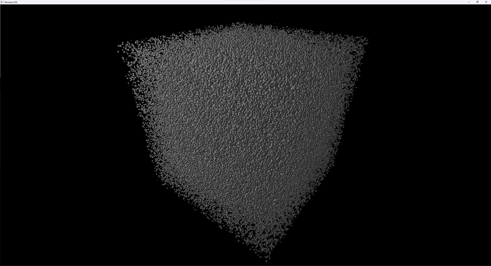
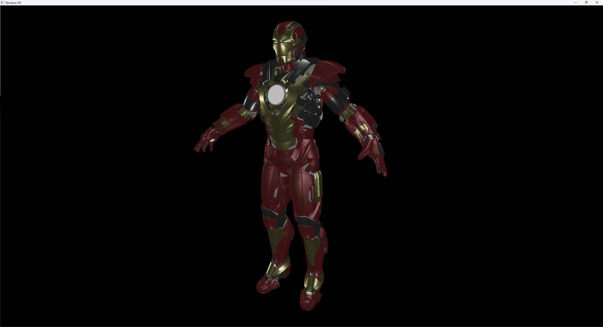
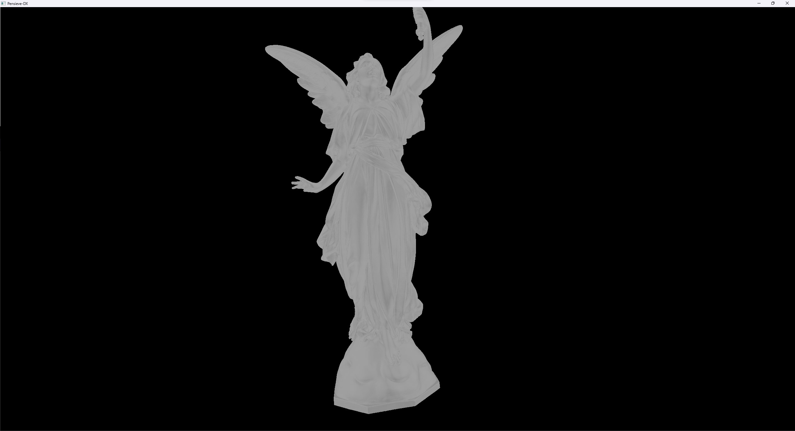

# 🌀 pensieve-dx 🌀
A 3D model viewer built on D3D12 using
- Mesh Shaders
- Shader Model 6.6 Dynamic Resources
- Enhanced Barriers

You have to use the included meshlet generator to create a meshletized version of your 3D model. Then you can feed the generated binary file into pensieve.

The following third party libraries are used:
- Assimp for model loading
- stb_image for texture loading
- DirectXMesh for meshlet generation
- D3D12 Memory Allocator for GPU memory management

